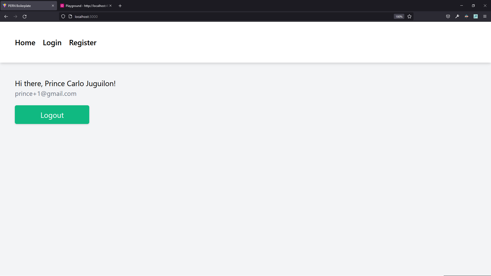
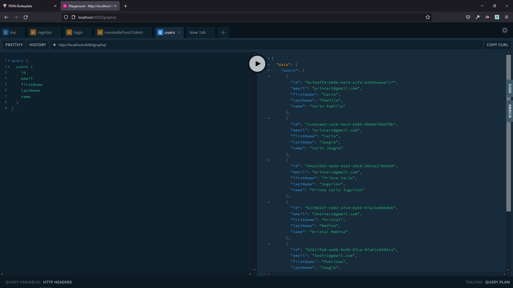

# PERN Boilerplate

🚧 `WORK IN PROGRESS` 🚧

`upcoming features:`
- Email confirmation
- Socials Login

## Features

- GraphQL Server
- JWT Authentication
- Auto refresh access tokens on expire
- Schema generation for client side (server schema stays in sync with client schema)

---

## Stack

### Client

- [React](https://reactjs.org/) + [Vite](https://vitejs.dev/)
- [Apollo GraphQL](https://www.apollographql.com/)
- [TailwindCSS](https://tailwindcss.com/) (css utility framework)
- [MobX](https://mobx.js.org/react-integration.html) (state-management)
- [Formik](https://formik.org/) (form handlers)

### Server

- express + [apollo-server-express](https://github.com/apollographql/apollo-server)
- [Postgres](https://www.postgresql.org/) (database)
- [TypeORM](https://typeorm.io/#/) (ORM)
- [class-validator](https://github.com/typestack/class-validator)
- [argon2](https://en.wikipedia.org/wiki/Argon2) (password encryption)
- [GraphQL](https://graphql.org/) endpoints (also compatible with REST)

---

## Usage

---

## Preview

### Client

### Server

---

Prince Carlo Juguilon
